<div align="center">


<h1>Identity Threat Protection Platform</h1>

<p><strong>The Institutional-Grade Proactive Enforcement Engine for Zero-Trust Access, Adaptive Authentication, and Real-Time Threat Mitigation</strong></p>

[]()
[]()
[]()
[]()

<br/>

> **"Identity is the primary vector; protection is the only defense."** 
> Identity Threat Protection is a flagship platform designed to go beyond detection by enforcing real-time proactive controls. By orchestrating adaptive authentication and conditional access across hybrid environments, it stops identity-based attacks before they impact the business.

</div>

---

## 🏛️ Executive Summary

The **Identity Threat Protection Platform** is a specialized flagship solution designed for CISOs, Security Architects, and IAM Leaders. While threat detection identifies attacks in progress, **Threat Protection** focuses on prevention and real-time mitigation. In a world of credential theft and MFA bypass, traditional "allow/deny" policies are no longer sufficient.

This platform provides an **Adaptive Enforcement Plane**. It demonstrates how to orchestrate real-time risk-based access using **FastAPI**, **React 18**, and **Terraform**. By integrating **Continuous Authentication**, **Device Posture Scoring**, and **Automated Session Revocation**, it ensures that every access attempt is verified against the current risk context, effectively enforcing Zero Trust principles across AWS, Azure, GCP, and on-premises environments.

---

## 📉 The "Protection Gap" Problem

Enterprises relying on legacy identity controls face significant defensive gaps:
- **Static Access Policies**: Policies that don't adapt to real-time risk (e.g., granting access to a "standard" user who is currently logging in from a high-risk geo).
- **Session Hijacking Vulnerability**: Once a session is established, it is often trusted indefinitely, allowing attackers to reuse stolen session tokens.
- **MFA Fatigue & Bypass**: Traditional MFA being defeated through "push bombardment" or adversary-in-the-middle (AiTM) proxies.
- **Privileged Shadow Access**: Lack of "Just-in-Time" (JIT) controls leading to excessive administrative accounts with perpetual access.

---

## 🚀 Strategic Drivers & Business Outcomes

### 🎯 Strategic Drivers
- **Zero Trust Implementation**: Moving from "Trust then Verify" to "Never Trust, Always Verify."
- **Cyber Resilience**: Proactively reducing the attack surface by hardening authentication flows and reducing dormant access.
- **Regulatory Compliance**: Meeting executive orders and regulatory requirements for "Phishing-Resistant MFA" and "Least Privilege."

### 💰 Business Outcomes
- **90% Reduction in Breach Impact**: Automated containment (account lock/token revocation) stops lateral movement in seconds.
- **Frictionless User Experience**: Reducing MFA prompts for low-risk scenarios while increasing security for high-risk attempts.
- **Unified Protection Policy**: Consistent enforcement of security baselines across heterogeneous cloud and SaaS providers.

---

## 📐 Architecture Storytelling: 30+ Advanced Diagrams

### 1. Executive Protection Architecture
*The orchestration of risk telemetry into proactive enforcement actions.*
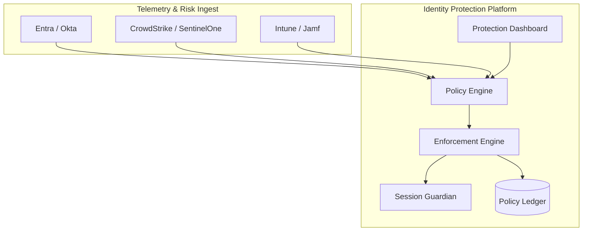

### 2. Hybrid Protection Topology
*Enforcing Zero Trust from the corporate datacenter to the cloud edge.*
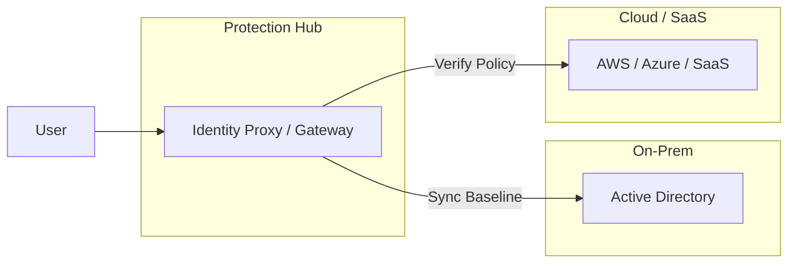

### 3. Risk-Based Access Control (RBAC 2.0)
*The path from auth request to adaptive enforcement.*
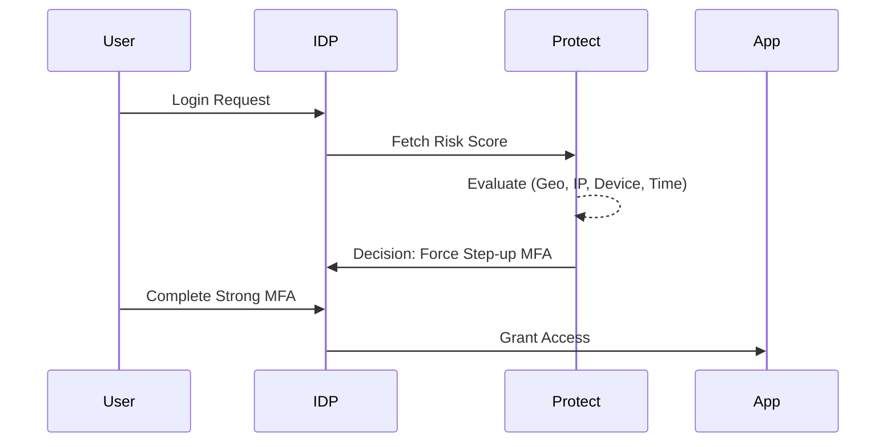

### 4. Adaptive MFA Enforcement Flow
*Scaling authentication strength based on real-time risk.*
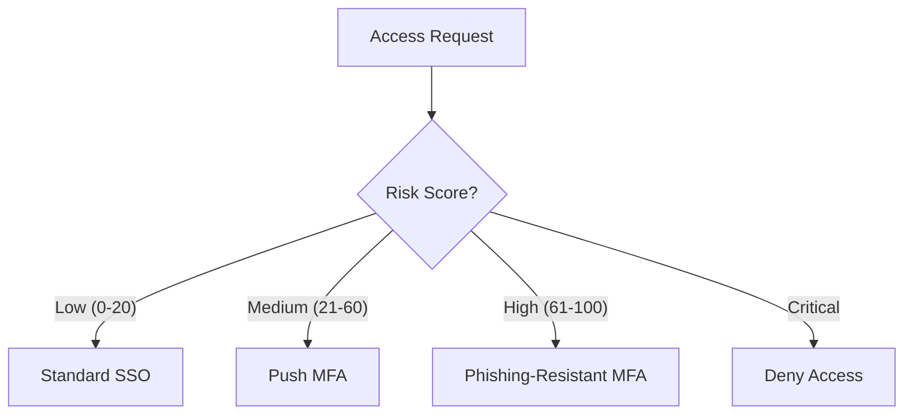

### 5. Conditional Access Strategy
*Standardizing policy enforcement across clouds.*
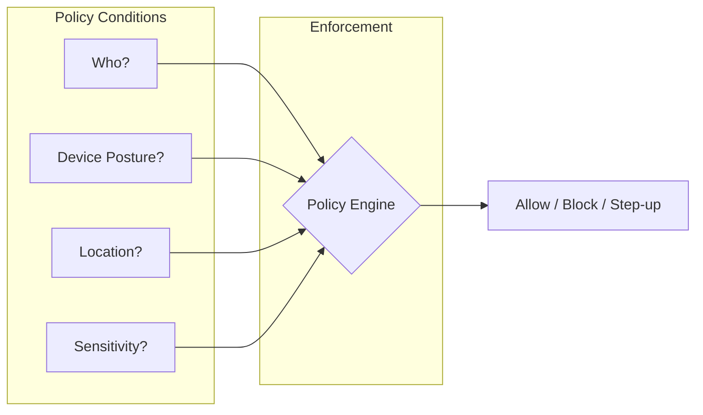

### 6. Continuous Session Guardian
*Monitoring active sessions for anomalous behavior.*
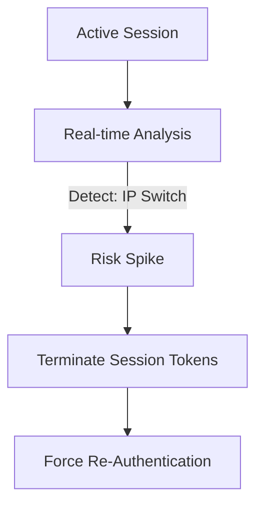

### 7. Just-in-Time (JIT) PAM Protection
*Preventing permanent privileged access.*
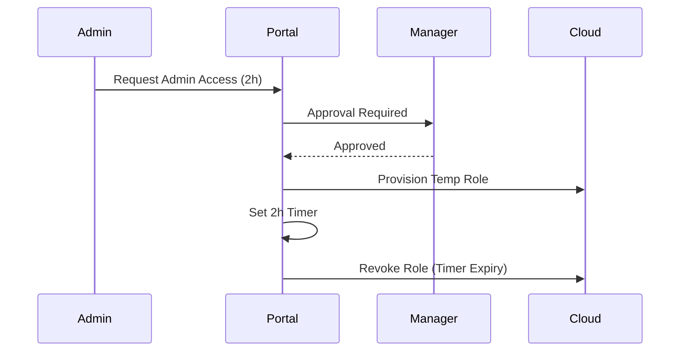

### 8. Token Protection & Revocation Flow
*Invalidating stolen tokens immediately.*
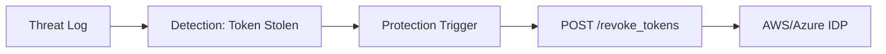

### 9. Device Trust Evaluation Model
*Integrating device health into access decisions.*
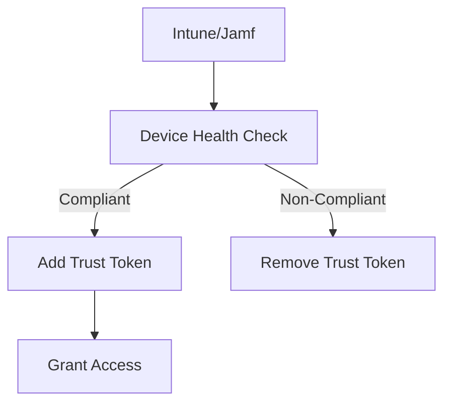

### 10. Automated Account Quarantine
*Isolating compromised identities from the ecosystem.*
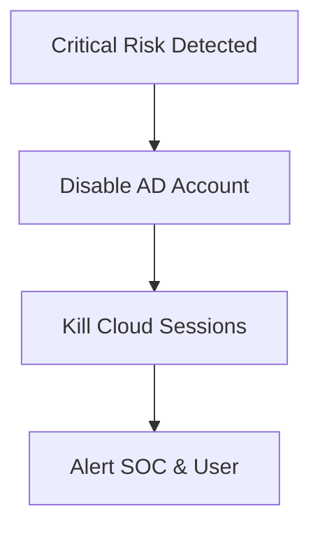

### 11. Phishing-Resistant MFA Path
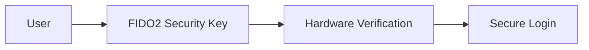

### 12. Passwordless Readiness Model
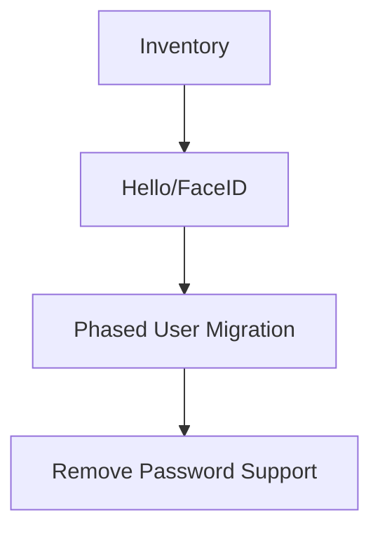

### 13. Hybrid Identity Security Baseline
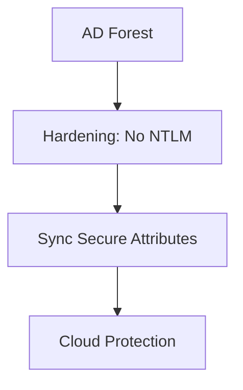

### 14. OIDC Client Protection Workflow
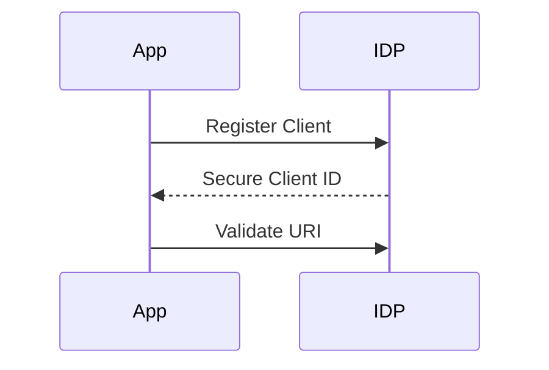

### 15. SAML Signature Verification Flow
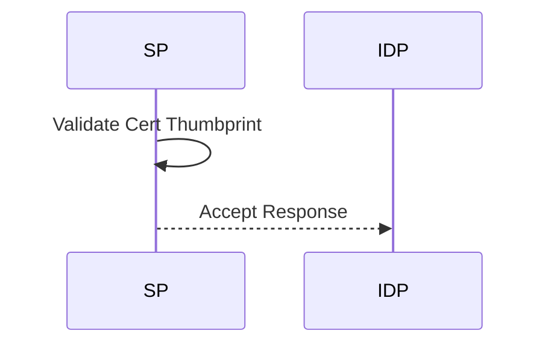

### 16. Token Life-cycle Protection
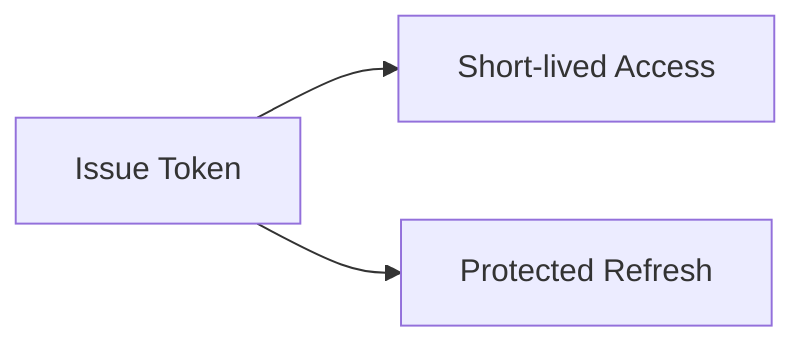

### 17. API Key Rotation Automation
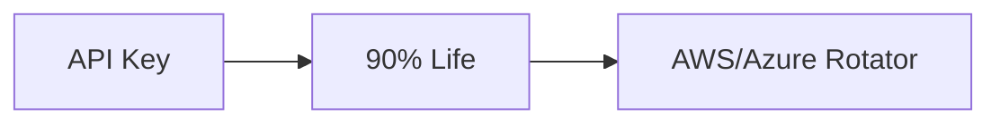

### 18. Conditional Access (Geo-Blocking)
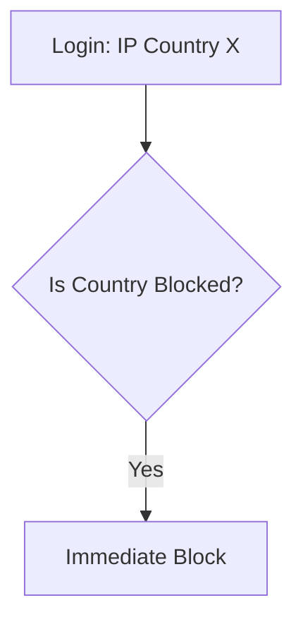

### 19. Privileged Session Recording & Lock
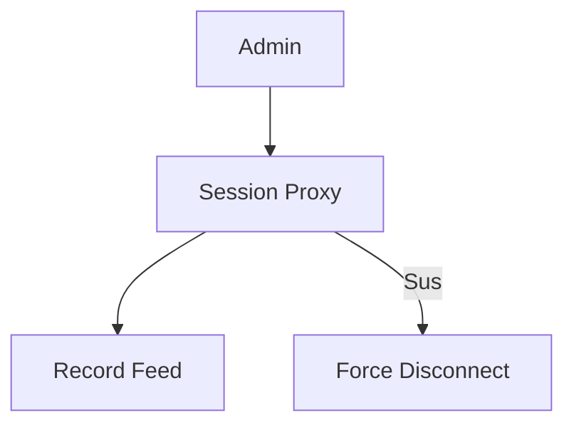

### 20. Identity Risk Score aggregation
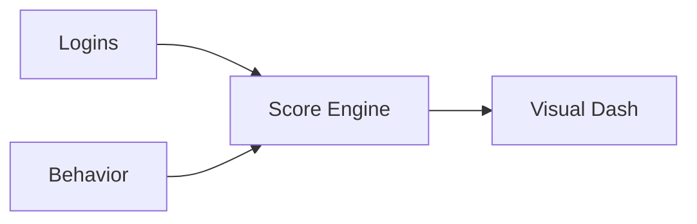

### 21. Real-time Enforcement Ingest
```mermaid
graph LR
    IDP[Okta] --> API[Protection API]
    API --> Enforce[Enforcement Logic]
```

### 22. Policy Versioning & Rollback
```mermaid
graph TD
    V1[Policy v1] --> Edit[Edit]
    Edit --> V2[Policy v2 (Draft)]
    V2 --> Deploy[Promote to Prod]
```

### 23. Zero Trust Posture Calculation
```mermaid
graph LR
    Metrics[MFA, JIT, Posture] --> Model[Stats Model]
    Model --> Maturity[Maturity Score]
```

### 24. SIEM Feedback Loop
```mermaid
graph LR
    SIEM[Alerts] --> API[Protection API]
    API --> Action[Auto-Remediate]
```

### 25. EDR Device Compliance Integration
```mermaid
graph LR
    EDR[CrowdStrike] --> API[Protection API]
    API -->|High Risk Host| Block[Block Identity Login]
```

### 26. MFA Bypass Prevention (FIDO)
```mermaid
graph TD
    Push[Push Bombardment] --> Deny[User Deny]
    Deny --> Lockdown[Enforce FIDO-Only]
```

### 27. Token Theft Prevention (Binding)
```mermaid
graph TD
    Token[Token] --> Bind[Bind to Device Hardware]
    Bind --> Usage[Usage: Valid Device Only]
```

### 28. Identity Lifecycle Hardening
```mermaid
stateDiagram-v2
    Creation --> Verification: MFA Setup
    Verification --> Usage: Daily RBAC
    Usage --> Termination: Auto-Cleanup
```

### 29. Regional Enforcement Availability
```mermaid
graph LR
    US[US Engine] <->|Global Policy Sync| EU[EU Engine]
```

### 30. Strategic Protection Roadmap
```mermaid
graph TD
    Now[Conditional Access] --> Goal[Continuous Trust Engine]
```

---

## 🛠️ Technical Stack & Implementation

### Protection Engine
- **Processing**: Python 3.11+ / FastAPI
- **Enforcement**: Real-time integration with IDP APIs (Okta, Entra ID, AWS).
- **State**: Redis (Session monitoring and risk-state windowing).

### Frontend (Policy Management)
- **Framework**: React 18 / Vite
- **Visuals**: Lucide Icons / Indigo Protection Theme.
- **Charts**: Recharts (Enforcement Trends & Risk Analytics).

### Infrastructure
- **IaC**: Terraform (Global EKS/DB deployment).
- **Secrets**: AWS Secrets Manager / HashiCorp Vault.

---

## 🚀 Deployment Guide

### Local Development
```bash
# Clone the repository
git clone https://github.com/devopstrio/identity-threat-protection.git
cd identity-threat-protection

# Setup environment
cp .env.example .env

# Launch services
make up
```
Access the Management Portal at `http://localhost:3000`.

---

## 📜 License
Distributed under the MIT License. See `LICENSE` for more information.
