<div align="center">


<h1>Identity Threat Protection</h1>

<p><strong>The Institutional-Grade Platform for Proactive Enforcement, Real-Time Risk Mitigation, and Zero-Trust Identity Protection.</strong></p>

[]()
[]()
[]()

<br/>

> **"Identity is the primary vector; protection is the only defense."** 
> **Identity Threat Protection** is an enterprise-grade platform designed to provide a secure, measurable, and highly automated foundation for global identity operations. It orchestrates the complex lifecycle of identity security—from AIOps-driven anomaly detection and risk-based conditional access to distributed session revocation and unified identity governance.

</div>

---

## 🏛️ Executive Summary

Fragmented identity controls and manual threat response processes are strategic security liabilities; lack of centralized identity orchestration is a primary barrier to organizational Zero Trust maturity. Organizations fail to maintain identity integrity not because of a lack of authentication tools, but because of fragmented protection standards, lack of automated risk validation, and an inability to orchestrate identity landing zones with operational precision.

This platform provides the **Identity Intelligence Plane**. It implements a complete **Enterprise Protection-as-Code Framework**, enabling Security and Identity teams to manage global identity threats as first-class citizens. By automating the identification of suspicious patterns through real-time login analysis and orchestrating the immediate revocation of compromised sessions, we ensure that every organizational identity—from privileged admin accounts to routine employee logins—is protected by default, audited for history, and strictly aligned with institutional identity frameworks.

---

## 📐 Architecture Storytelling: Principal Reference Models

### 1. Principal Architecture: Global Identity Threat & Intelligence Plane
This diagram illustrates the end-to-end flow from multi-cloud IdP ingestion and anomaly detection to risk-based auth, session revocation, and institutional identity auditing.

```mermaid
graph LR
    %% Subgraph Definitions
    subgraph IdentityIngress["Multi-Cloud & IdP Ingress"]
        direction TB
        Cloud_IdPs["Entra ID / Okta / Ping / Google"]
        Access_Logs["AuthN & AuthZ Telemetry"]
        User_Context["Behavioral & Geo Signals"]
    end

    subgraph IntelligenceEngine["Identity Intelligence Hub"]
        direction TB
        API["FastAPI Protection Gateway"]
        RiskEngine["Risk-Based Decision Hub"]
        EnforcementOrch["Remediation & Lock Orch"]
        SessionGuardian["Session Revocation Hub"]
    end

    subgraph OperationsPlane["Distributed Protection Fleet"]
        direction TB
        AnomalyNodes["AIOps Pattern Scanners"]
        ComplianceValidators["MFA & Policy Enforcers"]
        LockoutProxies["Distributed Lockout Proxies"]
    end

    subgraph OperationsHub["Institutional Identity Hub"]
        direction TB
        Scorecard["Identity Maturity Score"]
        Analytics["Remediation & Threat Stats"]
        Audit["Forensic Identity Metadata Lake"]
    end

    subgraph DevOps["Protection-as-Code Framework"]
        direction TB
        TF["Terraform Protection Modules"]
        ThreatBot["Compromised Identity Validator"]
        ChatOps["Lockout Approval Hub"]
    end

    %% Flow Arrows
    IdentityIngress -->|1. Submit Identity Data| API
    API -->|2. Evaluate Risk| RiskEngine
    RiskEngine -->|3. Identify Remediation| EnforcementOrch
    EnforcementOrch -->|4. Revoke Session| SessionGuardian
    
    SessionGuardian -->|5. Execute Lockout| OperationsPlane
    OperationsPlane -->|6. Notify Status| ChatOps
    API -->|7. Visualize Health| Scorecard
    
    Scorecard -->|8. Track Posture| Analytics
    Scorecard -->|9. Record Threat| Audit
    
    TF -->|10. Provision Hub| IntelligenceEngine
    ThreatBot -->|11. Inject Compromise Risk| RiskEngine
    Audit -->|12. Improve Protection| AnomalyNodes

    %% Styling
    classDef ingress fill:#f5f5f5,stroke:#616161,stroke-width:2px;
    classDef intel fill:#e8eaf6,stroke:#1a237e,stroke-width:2px;
    classDef enforcement fill:#e1f5fe,stroke:#01579b,stroke-width:2px;
    classDef ops fill:#ede7f6,stroke:#311b92,stroke-width:2px;
    classDef devops fill:#e8f5e9,stroke:#1b5e20,stroke-width:2px;

    class IdentityIngress ingress;
    class IntelligenceEngine intel;
    class OperationsPlane enforcement;
    class OperationsHub ops;
    class DevOps devops;
```

### 2. The Identity Threat Lifecycle Flow
The continuous path of an identity threat from initial detection (anomaly) and triage (risk score) to active containment (account lock), eradication, recovery, and institutional forensic auditing.

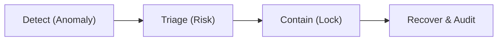

### 3. Distributed Identity Protection Topology
Strategically orchestrating threat detection and remediation across multi-cloud IdPs (Entra ID, Okta, Ping), providing a unified institutional view of global identity health and threat coverage.

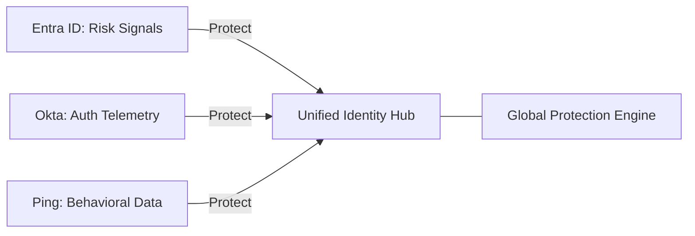

### 4. AIOps Identity Anomaly & Pattern Validation Flow
Executing complex logic for identifying suspicious login patterns—including impossible travel, brute force attempts, and MFA fatigue—ensuring every organizational login is verified against real-time risk telemetry.

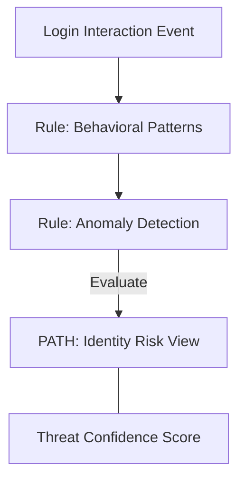

### 5. Conditional Access & Risk-Based Auth Flow
Automatically triggering MFA challenges or blocking access based on real-time risk telemetry and institutional policy, ensuring zero-latency protection against credential-based attacks.

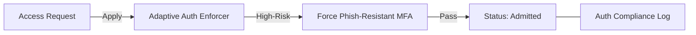

### 6. Session Revocation & Distributed Lockout Flow
Managing the lifecycle of a compromised identity, automatically terminating active sessions across all cloud and on-premises applications, ensuring zero-standing-privilege during an active incident.

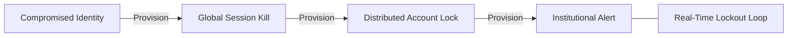

### 7. Institutional Identity Maturity Scorecard
Grading organizational performance based on key indicators: Identity Posture Grade, Remediation Velocity, and Threat Coverage Index.

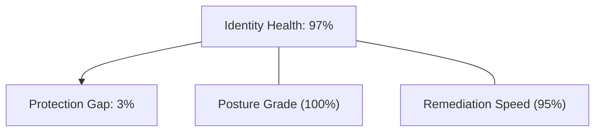

### 8. Identity & RBAC for Threat Governance
Managing fine-grained access to protection hubs, remediation triggers, and audit logs between Security Analysts, Identity Architects, and Incident Responders.

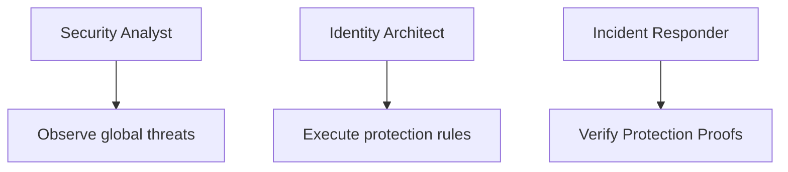

### 9. IaC Deployment: Protection-as-Code Framework
Using modular Terraform to deploy and manage the versioned distribution of the protection tracking hubs, analytics workers, and forensic metadata lakes.

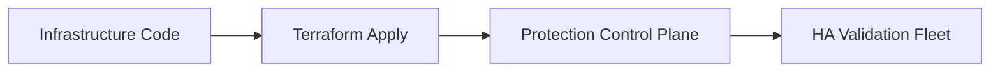

### 10. Credential Leakage & Dark Web Monitoring Flow
Using advanced analytics to identify compromised corporate credentials on the dark web or public breaches before they are used for attacks, ensuring proactive institutional defense.

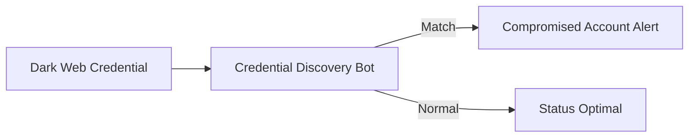

### 11. Metadata Lake for Forensic Identity Audit
Storing long-term records of every login attempt, every threat detected, and every remediation action executed for institutional record-keeping, compliance auditing, and post-threat forensics.

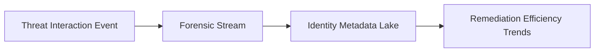

---

## 🏛️ Core Protection Pillars

1.  **Unified Identity Coordination**: Maximizing resilience by centralizing all identity protection through a single institutional plane.
2.  **Automated Anomaly Enrichment**: Eliminating "suspicious login" scenarios through proactive behavioral and geo-pattern verification.
3.  **Sequential Remediations Intelligence**: Ensuring zero-interruption operations through dependency-aware multi-cloud account locks.
4.  **Zero-Trust Session Protection**: Automatically enforcing continuous authentication and identity-based session revocation.
5.  **Autonomous Protection Logic**: Guaranteeing reliability through automated industry-specific identity monitoring runbooks.
6.  **Full Identity Auditability**: Immutable recording of every threat detected and lockout action for institutional forensics.

---

## 🛠️ Technical Stack & Implementation

### Protection Engine & APIs
*   **Framework**: Python 3.11+ / FastAPI.
*   **AIOps Engine**: Integration with Cloud IdP Risk APIs (Microsoft Graph, Okta, Ping) and SIEM/SOAR signals.
*   **Enforcement Core**: Custom Python-based logic for distributed session revocation and multi-directory account lockout.
*   **Persistence**: PostgreSQL (Identity Ledger) and Redis (Live Job State).
*   **Auth Orchestrator**: Federated OIDC/SAML for least-privilege identity management access.

### Governance Dashboard (UI)
*   **Framework**: React 18 / Vite.
*   **Theme**: Dark, Indigo, Slate (Modern high-fidelity identity aesthetic).
*   **Visualization**: D3.js for identity topologies and Recharts for remediation velocity analytics.

### Infrastructure & DevOps
*   **Runtime**: AWS EKS or Azure Kubernetes Service (AKS) for management plane.
*   **Guardian Hub**: Managed event sourcing for immutable identity threat timeline reconstruction.
*   **IaC**: Modular Terraform for deploying the identity landing zone and validation fleet.

---

## 🏗️ IaC Mapping (Module Structure)

| Module | Purpose | Real Services |
| :--- | :--- | :--- |
| **`infrastructure/idp_hub`** | Central management plane | EKS, PostgreSQL, Redis |
| **`infrastructure/workers`** | Distributed protection fleet | K8s Workers, Cloud APIs |
| **`infrastructure/guardians`** | Session Revocation Orchestrators | Webhooks, Lambda |
| **`infrastructure/auditing`** | Forensic identity sinks | S3, Athena, Quicksight |

---

## 🚀 Deployment Guide

### Local Principal Environment
```bash
# Clone the identity platform
git clone https://github.com/devopstrio/identity-threat-protection.git
cd identity-threat-protection

# Configure environment
cp .env.example .env

# Launch the Identity stack
make init

# Trigger a mock anomaly detection and automated account lockout simulation
make simulate-identity
```

Access the Management Dashboard at `http://localhost:3000`.

---

## 📜 License
Distributed under the MIT License. See `LICENSE` for more information.

---
<div align="center">
  <p>© 2026 Devopstrio. All rights reserved.</p>
</div>
