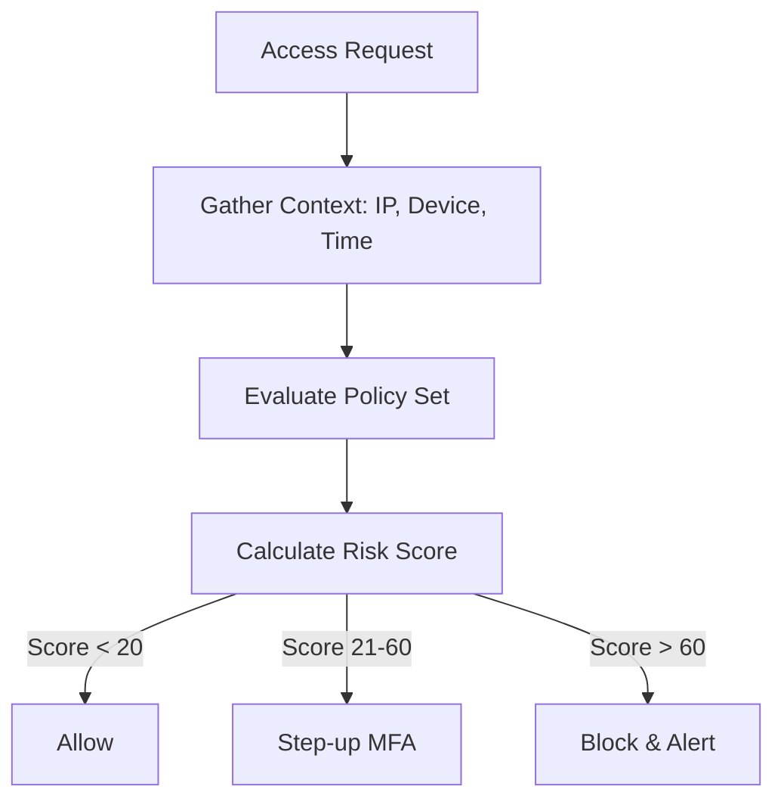
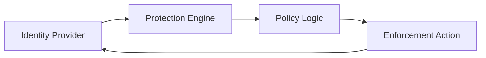
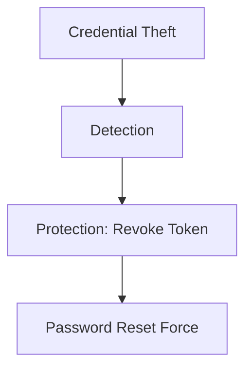

# Architecture & Flow Diagrams

## 11. Risk-Based Access Flow (Detailed)
*How the protection engine evaluates every access attempt against real-time risk.*

## 13. Conditional Access Enforcement Loop

## 20. Identity Protection Kill Chain

