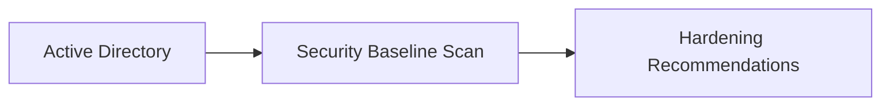
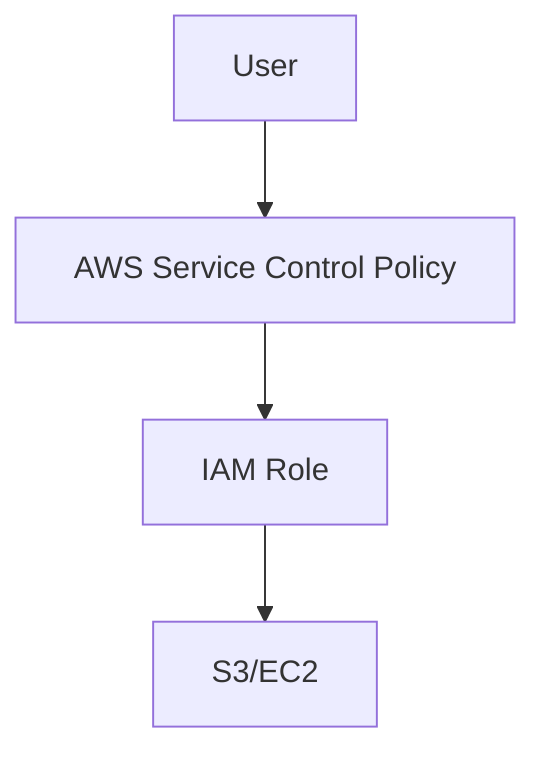
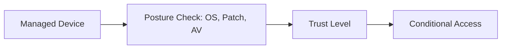

# Security & Integration Diagrams

## 31. Active Directory Hardening

```mermaid
graph LR
    AD[Active Directory] --> Scan[Security Baseline Scan]
    Scan --> Report[Hardening Recommendations]
```

## 34. AWS Identity Protection Flow

```mermaid
graph TD
    User[User] --> SCP[AWS Service Control Policy]
    SCP --> Permissions[IAM Role]
    Permissions --> Resource[S3/EC2]
```

## 40. Device Posture Trust Model

```mermaid
graph LR
    Device[Managed Device] --> Posture[Posture Check: OS, Patch, AV]
    Posture --> Trust[Trust Level]
    Trust --> Access[Conditional Access]
```
